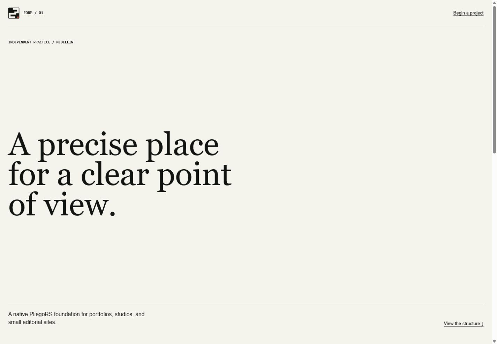
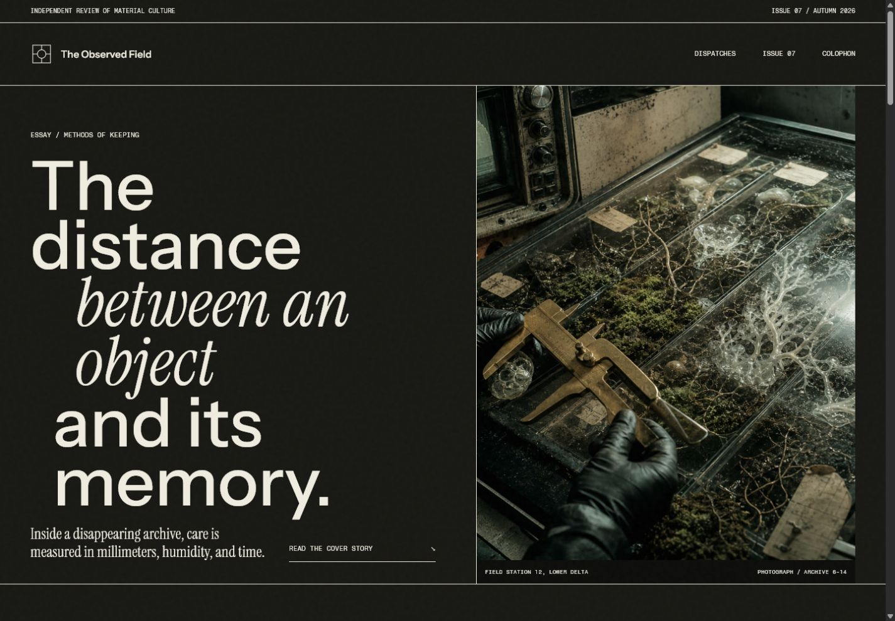
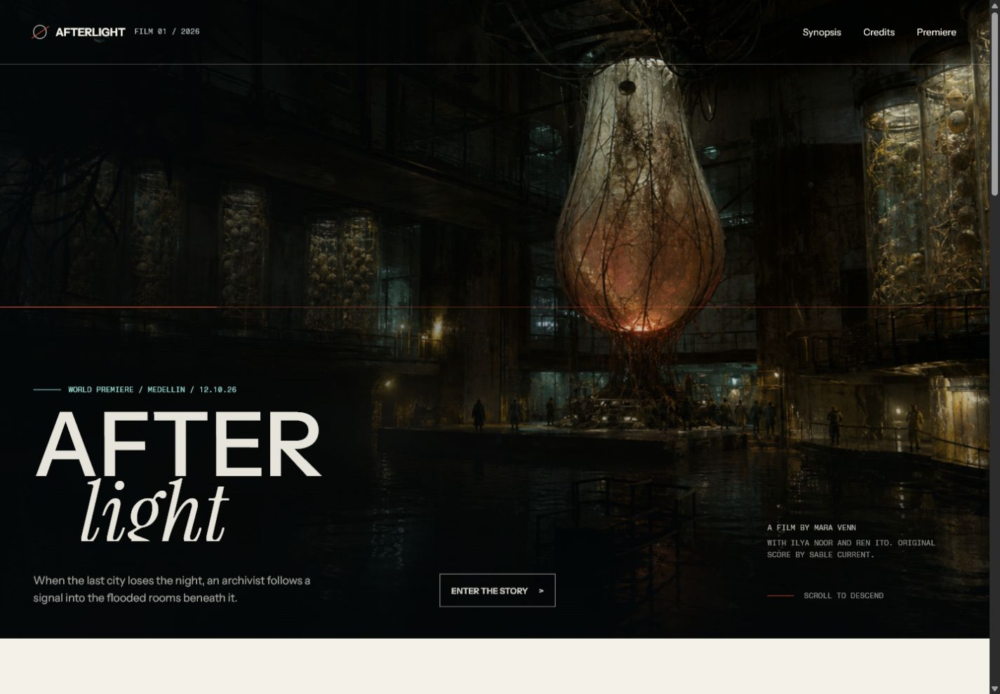
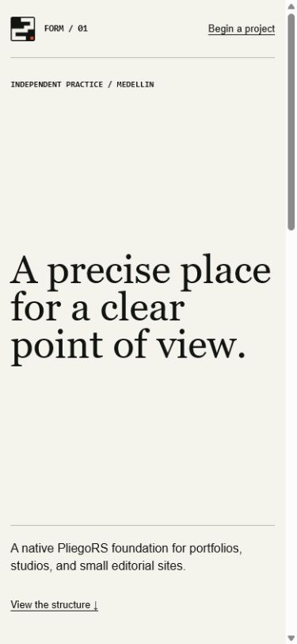
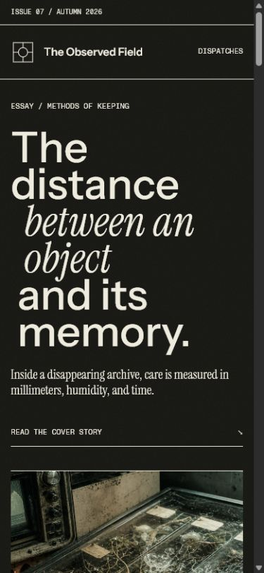
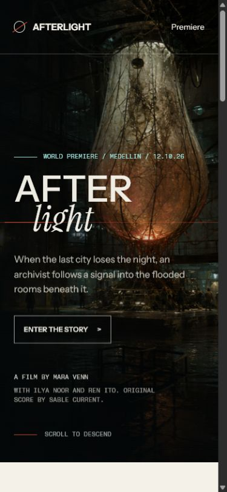

# Official starters and CLI diagnostics

**Status:** R5 accepted; official first-use contract revision 2 on 2026-07-16

## Architecture

Official starters belong to `pliego-starters`, not `pliego-cli`. Each starter
owns its Cargo manifest template, PliegoRS manifest template, ignore policy,
Rust source, assets, README, revision, and capability declaration. The CLI links
the crate and embeds its bytes, so the distributed executable remains
standalone without acquiring project identity or asset ownership.

Scaffolding is transactional:

1. Parse the requested starter and explicit dependency source.
2. Reject non-portable paths, reserved paths, case-insensitive duplicates,
   file/directory collisions, symbolic-link destinations, and unresolved tokens.
3. Render typed plain-text or JSON tokens into a sibling staging directory.
4. Create every file with `create_new` semantics.
5. Rename the complete staged tree into the final empty destination.

The dependency order is explicit and reproducible:

1. `--framework-path <checkout>`;
2. `PLIEGO_FRAMEWORK_PATH`;
3. the canonical PliegoRS Git repository at the exact source revision embedded
   in the CLI.

The CLI does not silently switch to local path dependencies because it happens
to run inside a PliegoRS checkout.

## Catalog

| ID | Revision | Intended use | Capabilities |
| --- | ---: | --- | --- |
| `default` | 2 | first replayable PliegoRS application | SSG, events, projection, replay tests, branded errors |
| `minimal` | 1 | studios, portfolios, small authored sites | SSG, SEO, responsive |
| `editorial` | 1 | journals, archives, research, publishing | SSG, SEO, local media, dark mode |
| `cinematic` | 1 | films, festivals, visual launches | SSG, SEO, local media, adaptive motion |

```powershell
pliego templates
pliego new my-project
pliego new my-journal --template editorial
pliego new my-film --template cinematic
```

`default` is the explicit CLI default. It ships a typed action, versioned event,
sealed schema catalog, reducer identity, transactional projection, live versus
replay test, snapshot-tail test, invalid-action test, `/`, `/guide/`, an
authored `/404.html`, local identity assets, metadata, and Apache-2.0 license.
The other entries remain opt-in design starters.

Each generated README identifies the source, identity, domain, metadata, image,
font, copy, and style files that must be changed before launch. Demonstration
brands and domains are deliberately visible rather than hidden in framework
internals.

The editorial and cinematic source trees also include the complete SIL OFL
license texts and a `THIRD_PARTY_NOTICES.md` file. A crate test requires those
files whenever a starter embeds local font binaries. Every maintained starter
ships the framework `LICENSE` file.

## Diagnostics

Human diagnostics include a stable identifier, category, message, next action,
bounded primary spans when compiler or manifest locations exist, and additional
fix suggestions. Machine consumers receive the same contract as one JSON object
with `spans[]` and `fixes[]`; fixes state their `manual` applicability:

```powershell
pliego build --diagnostic-format json
```

| Exit | Identifier family | Meaning |
| ---: | --- | --- |
| `0` | none | success |
| `2` | `PLG-ARG-*` | command, option, port, or starter selection |
| `3` | `PLG-PRJ-*`, `PLG-NEW-*` | project discovery/configuration or scaffold transaction |
| `4` | `PLG-ENV-*` | package target, Rust target, or required tool |
| `5` | `PLG-BLD-*` | compilation or site build |
| `6` | `PLG-ART-*` | missing or invalid build artifact/ledger |
| `7` | `PLG-SRV-*` | preview/development server |

`pliego dev` keeps serving when the initial build or a rebuild fails. Document
requests receive a branded HTTP 500 diagnostic surface containing
`PLG-BLD-001`, escaped compiler output, a concrete recovery instruction, and the
typed HMR channel. Successful recompilation clears the failure and applies CSS,
content, adapter, or full-document recovery as classified by the causal graph.
Missing routes use the project's authored `/404.html`; when
one is absent, the server returns a branded `PLG-HTTP-404` fallback instead of
an untyped text response.

## Acceptance evidence

The committed [R5 evidence](evidence/r5-golden-developer-experience.md) replaces
the pre-causal-graph file counts and hashes previously recorded here. The
standalone default starter is scaffolded outside the workspace, checked, runs
all three replay tests, builds, verifies, answers `why artifact /`, and is timed
from release-binary installation through that complete path. The native watcher
acceptance additionally proves CSS and content HMR plus `why-rebuilt` against a
real generated project.

Browser acceptance used 1440x1000 desktop and 390x844 mobile viewports. All six
cases had zero horizontal overflow, zero clipped text, and no failed visible
images. Editorial lazy images were additionally loaded after a 7,117-pixel
scroll and all reported their real 1536-pixel intrinsic width.

`pliego-starters` also passes Cargo's packaged-tarball verification. Framework
crates explicitly reject registry publication;
the distributed CLI instead generates `git + rev` dependencies that resolve
the same canonical source commit on every machine once the repository opens.

| Minimal | Editorial | Cinematic |
| --- | --- | --- |
|  |  |  |
|  |  |  |
